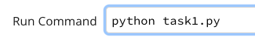
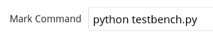
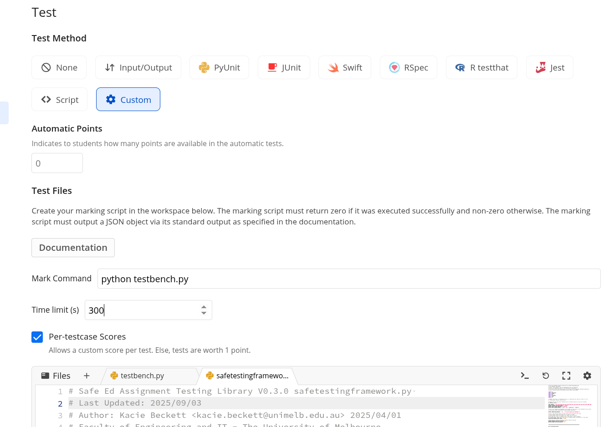

# Note
See COMP10001 Worksheet Repository on Ed for runnable tests/examples etc
https://edstem.org/au/courses/20911/lessons/79913/slides/539891

# Usage Instructions (Reproduced from Ed at moment)
- Add the Run command using the same file name as in the Scaffold section, so that students can test their code without using the terminal. (e.g.) python task1.py or program.py

  

- Choose "Custom" Test Method
- Add the Mark Command as python testbench.py or whatever the test file

  

- Ensure your Time Limit(s)is set to 300 (the maximum) or high enough relative to the timeout set within each test
- Check the Per-testcase Scores box
- Scroll down to advanced settings and enable Display Files by checking the box. This means the "test report" test cases can generate a txt file transcript of the complete program execution and a seperate file describing what each test is checking, aswell as show the expected output files if any.
- Copy the file safetestingframework.py into testing environment (see the "Releases" page for the most up-to date version, or copy it from below if the version number matches the most recent release)
- Create a testbench.py with relevant tests for the task.
    - See "Testbench Template Generator" page to minimise manual copy pasting effort.

  

# Notes:
- Hidden Tests show pass or fail, but not the input or output
- Private Tests do not show pass or fail, or the input and output
- Students cannot see the name of a hidden tests
- The tests will display to staff showing the name followed by (hidden) or (private) when set respectively
- The tests will display in the order they are defined in the test case file

### `testbench-minimal.py`
- This is the file you should write your tests into.

- See Testbench Template Generator slide, to help with setting up tests, and the feature tests slide / feature testbench for examples that are setup.

### `safetestingframework.py`
- This file can be reproduced exactly, unless fixes or changes are needed.
